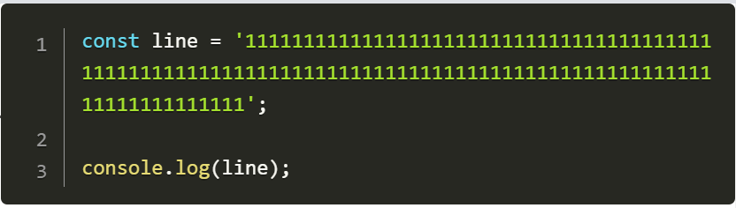

# Prism Line Break


## Installation

```bash
npm install @sinm/prism-line-break
```

## Usage
```js
import Prism from 'prismjs/components/prism-core';

import 'prismjs/plugins/line-numbers/prism-line-numbers';
import 'prismjs/plugins/line-numbers/prism-line-numbers.css';

import lineBreak from '@sinm/prism-line-break';

/**
 * <pre class="line-numbers">
 *   <code class="language-js">
 *    ...
 *   </code>
 * </pre> 
 */
const code = document.queySelect('code');
const clear = lineBreak(code);
Prism.highlightElement(codeRef.current);

// when unmount
clear();
```
